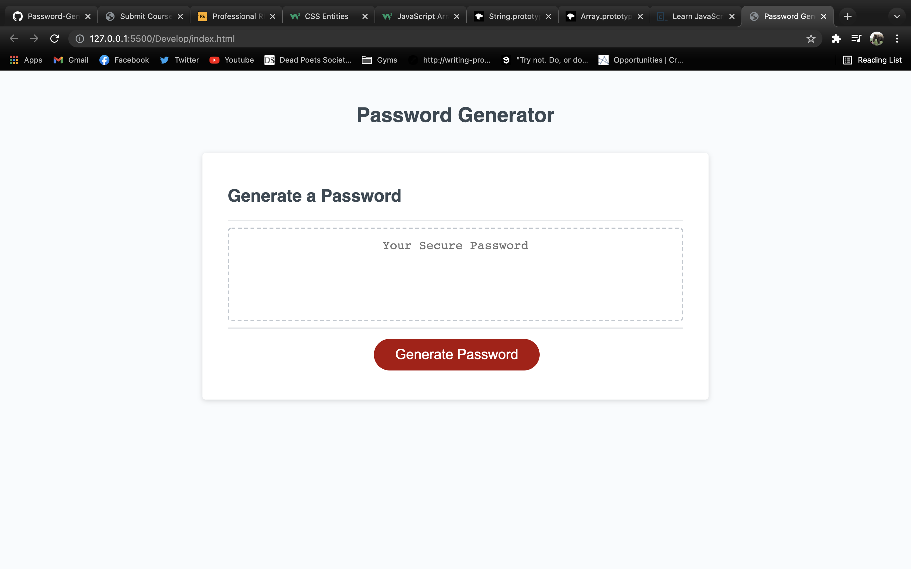
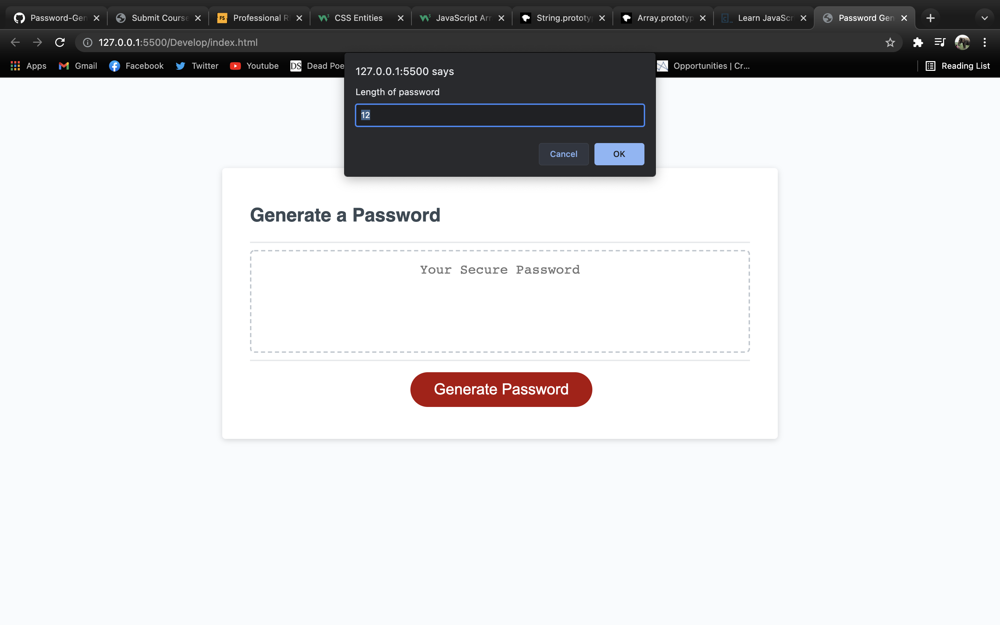
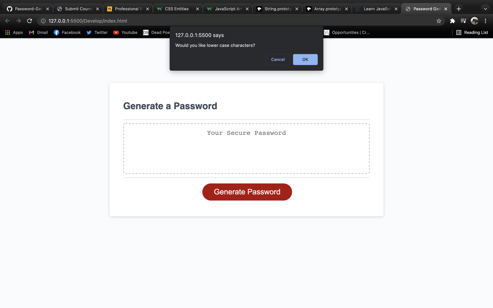
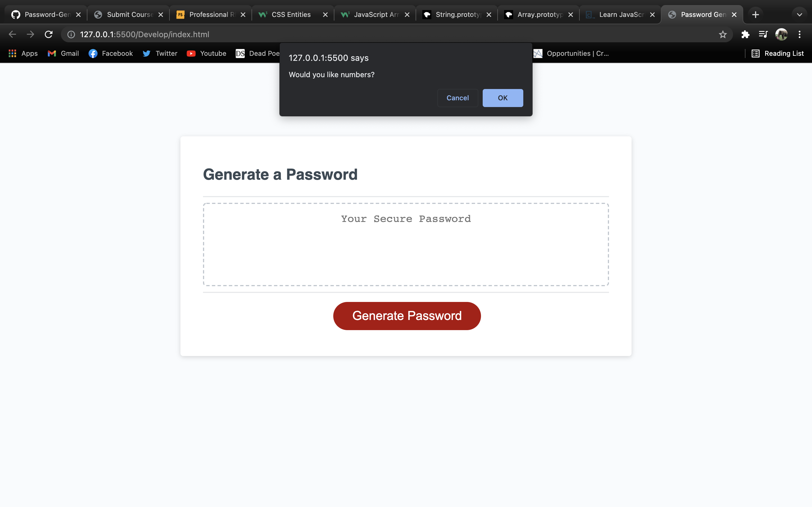
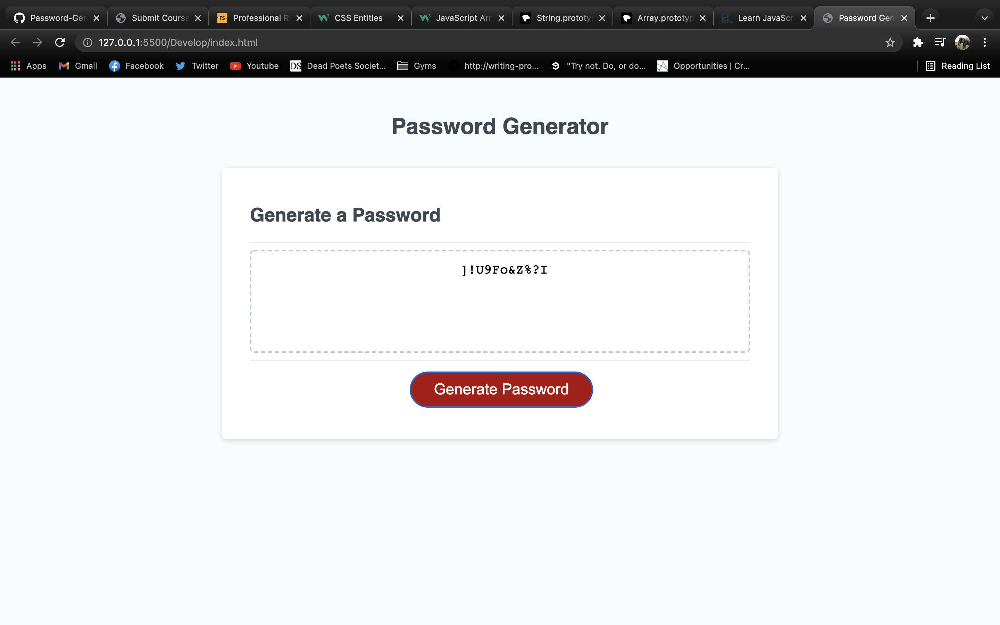

# Password-Generator

## Description

I created a password generator that meets the needs of any user to meet any password requirement, from 8 to 128 characters.

There are prompts for options including special characters, numbers, lowercase letters, and uppercase letters.

## User Story
 
Click "generate passport" and some prompt alerts will come up for the user to choose parameters for the password to have. Once all the prompts are answered, a password will appear in the text box for the user to copy and use as their new password!

## Deployed Site
https://jamierose528.github.io/Password-Generator/ 

## Repository
https://github.com/jamierose528/Password-Generator

## Contact
github: https://github.com/jamierose528
 
email: jamie.rose.528@gmail.com

## Screenshots

